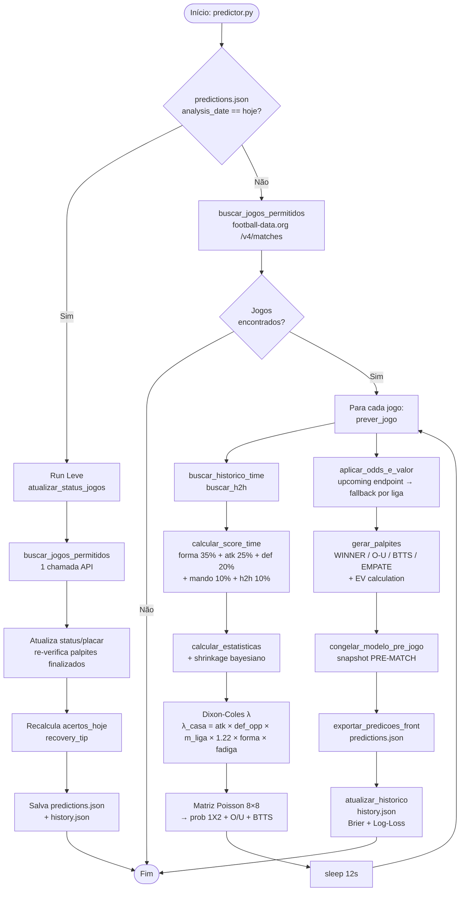
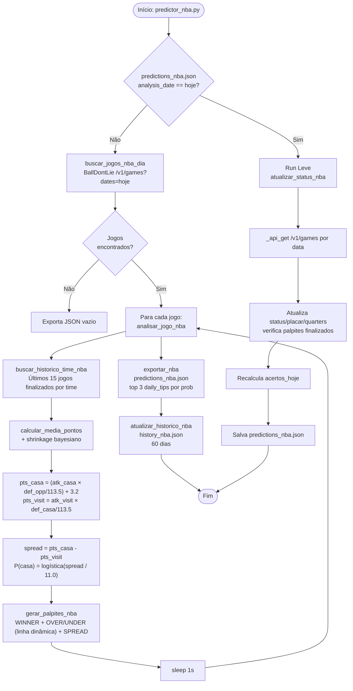
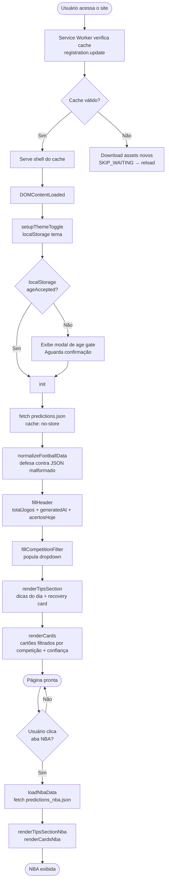

# Análise de Engenharia de Software — Palpitando

> Documento gerado em 03/05/2026. Descreve a arquitetura, o fluxo de dados, as regras de negócio e os riscos identificados no sistema.

---

## 1. Visão Geral do Sistema

O **Palpitando** é um assistente de apostas esportivas no formato PWA (Progressive Web App), hospedado como site estático no GitHub Pages. Existe uma separação clara entre **backend** (Python, executa em ambiente controlado/CI) e **frontend** (HTML/JS, carregado pelo navegador do usuário):

```
[ GitHub Actions / Cron ]
        │
        ▼
predictor.py ──────────────────► predictions.json ◄──── app.js (frontend)
predictor_nba.py ──────────────► predictions_nba.json
        │
        ▼
history.json / history_nba.json
```

O ciclo de vida de dados é: **gerar → exportar JSON estático → frontend lê e renderiza**. Não há banco de dados nem API própria.

---

## 2. Backend — Futebol (`predictor.py`)

### 2.1 Decisão de Execução (ponto de entrada `main()`)

A cada run o script verifica se `predictions.json` já contém `analysis_date == hoje`:

| Condição | Caminho |
|---|---|
| Primeiro run do dia | **Análise completa** (~N×12s por jogo) |
| Runs seguintes | **Run leve** (1 chamada de API, só atualiza status/placar) |

Isso economiza cota de API e tempo de execução.

---

### 2.2 Análise Completa (Primeiro Run)

#### Etapa 1 — Buscar Jogos (`buscar_jogos_permitidos`)

- Chama `football-data.org v4 /v4/matches` com janela de datas em UTC cobrindo o dia local em `America/Sao_Paulo`
- Filtra por `COMPETICOES_PERMITIDAS` (Premier League, La Liga, Bundesliga etc.)
- Exclui cancelados/adiados

#### Etapa 2 — `prever_jogo(match)` — para cada jogo (com `sleep(12s)` para respeitar rate limit)

**a) Coleta de histórico:**
- `buscar_historico_time(id, limit=10)` — últimos 10 jogos finalizados do time
- `buscar_h2h(id1, id2, limit=5)` — últimos 5 confrontos diretos

**b) Score qualitativo (`calcular_score_time`):**

$$ScoreTempo = 0.35 \times forma + 0.25 \times ataque + 0.20 \times defesa + 0.10 \times fator\_mando + 0.10 \times h2h$$

Esse score é usado apenas para o **fator de forma** no λ e para exibição de tendência.

**c) Estatísticas + Shrinkage Bayesiano:**

- Separa histórico por posição (jogos em casa / fora)
- Calcula médias de gols marcados/sofridos
- Aplica shrinkage: quando há poucos jogos, puxa a média em direção à média da liga

$$m_{ajustado} = \min\left(1, \frac{n}{K}\right) \times m_{time} + \left(1 - \min\left(1, \frac{n}{K}\right)\right) \times m_{liga}$$

onde $K = 6$ (jogos para peso total) e peso mínimo = 0.20.

**d) Modelo Dixon-Coles — Gols Esperados (λ):**

$$\lambda_{casa} = atk_{casa} \times def_{visita} \times \frac{m_{liga}}{2} \times 1.22 \times f_{forma} \times f_{fadiga}$$

$$\lambda_{visita} = atk_{visita} \times def_{casa} \times \frac{m_{liga}}{2} \times f_{forma} \times f_{fadiga}$$

Fatores de ajuste:

| Fator | Valor |
|---|---|
| HOME_ADVANTAGE | `1.22` (fixo) |
| Forma recente | `0.85 + score.forma × 0.30` (±15%) |
| Fadiga back-to-back (≤2 dias) | `0.86` |
| Fadiga descanso curto (≤4 dias) | `0.93` |
| Sem fadiga | `1.0` |
| Clamp λ | `[0.3, 5.0]` |
| Clamp forças relativas | `[0.3, 3.0]` |

**e) Matriz de Poisson 8×8:**

$$P(h\ gols, a\ gols) = PMF(\lambda_{casa}, h) \times PMF(\lambda_{visita}, a)$$

Mercados agregados:

| Mercado | Cálculo |
|---|---|
| `prob_casa` | $\sum P(h > a)$ |
| `prob_empate` | $\sum P(h = a)$ |
| `prob_visitante` | $\sum P(h < a)$ |
| `over_25` | $\sum P(h + a \geq 3)$ |
| `btts_yes` | $\sum P(h > 0\ \land\ a > 0)$ |

#### Etapa 3 — `aplicar_odds_e_valor`

1. **Pré-gate**: só consulta odds se `edge(1X2) ≥ 10%`
2. Tenta endpoint único `/sports/upcoming/odds` (1 crédito de API)
3. Se retornar vazio → fallback por liga (até `ODDS_MAX_SPORT_CALLS = 3` chamadas)
4. Normaliza nomes de times via `_ALIASES_TIME` e faz **de-vig** das odds para obter probabilidades justas
5. Calcula EV: $EV = \frac{p_{modelo}}{p_{justa}} - 1$; marca `valor_esperado_positivo` se $EV \geq 3\%$

#### Etapa 4 — `gerar_palpites`

Gera até 4 sugestões por jogo:

| Palpite | Lógica de Confiança | Condição extra |
|---|---|---|
| WINNER | Edge = prob1° − prob2°; `HIGH >25%`, `MEDIUM >12%` | Sempre gerado |
| OVER/UNDER 2.5 | Edge = prob − 50%; `HIGH >15%`, `MEDIUM >7%` | Sempre gerado |
| BTTS | Igual ao O/U | Sempre gerado |
| EMPATE | `MEDIUM` se prob_empate > 35%, senão `LOW` | Só se `prob_empate > 30%` **e** ambas defesas > 50% |

#### Etapa 5 — `congelar_modelo_pre_jogo`

- Jogos `SCHEDULED/TIMED`: usam cálculo atual
- Jogos `IN_PLAY/FINISHED`: restauram probabilidades do snapshot salvo no run anterior
- Jogos iniciados **sem** snapshot prévio: **removidos** da saída para não contaminar métricas

#### Etapa 6 — `exportar_predicoes_front`

Serializa para `predictions.json` com:

- Metadados: `generated_at`, `analysis_date`, `total_jogos`
- Array `jogos` com todas as predições
- `daily_tips_ids`: IDs dos top jogos congelados no início do dia (por `favorito.prob`)
- `recovery_tip`: ativado se o palpite principal da dica_1 errou
- `acertos_hoje`: contagem de ACERTO/ERRO

#### Etapa 7 — `atualizar_historico`

Acumula jogos finalizados em `history.json` (últimos **2 dias**), calculando métricas probabilísticas:
- **Brier Score** por mercado (1X2, O/U, BTTS)
- **Log-Loss** por mercado

---

### 2.3 Run Leve (`atualizar_status_jogos`)

1. Chama a API uma vez para buscar status atual dos jogos
2. Para cada jogo no JSON, compara status e placar
3. Se mudou: atualiza, re-verifica palpites se finalizado (`_verificar_palpites_dict`)
4. Recalcula `acertos_hoje`
5. Reconstrói `recovery_tip` se necessário (mesma lógica do run completo)
6. Atualiza `generated_at` e salva `predictions.json` + `history.json`

---

## 3. Backend — NBA (`predictor_nba.py`)

### 3.1 Modelo

Mais simples que o futebol — não usa Poisson, usa **modelo multiplicativo com vantagem de casa fixa**:

$$pts_{casa} = \left(m\_marc_{casa} \times \frac{m\_sofr_{visita}}{113.5}\right) + 3.2$$

$$pts_{visita} = m\_marc_{visita} \times \frac{m\_sofr_{casa}}{113.5}$$

Probabilidade de vitória da casa via **logística sobre o spread**:

$$P(casa) = \frac{1}{1 + e^{-1.702 \times (spread / 11.0)}}$$

### 3.2 Palpites NBA

| Palpite | Lógica |
|---|---|
| WINNER | Edge = `abs(prob_casa - prob_visit)`; `HIGH ≥30%`, `MEDIUM ≥15%` |
| OVER/UNDER | Linha dinâmica arredondada para 0.5 baseada em `total_esperado`; confiança por edge |
| SPREAD | Confiança por magnitude do spread: `HIGH ≥8pts`, `MEDIUM ≥4pts` |

### 3.3 Diferenças importantes em relação ao futebol

| Aspecto | Futebol | NBA |
|---|---|---|
| API | football-data.org | BallDontLie |
| Modelo | Poisson Dixon-Coles | Multiplicativo + logística |
| Odds externas | Sim (The Odds API) | Não |
| Freeze pré-jogo | Sim | Não |
| Histórico salvo | 2 dias | 60 dias |
| Daily tips | Congeladas no 1° run | Top 3 por `favorito.prob` na exportação |

---

## 4. Frontend (`app.js` + `index.html`)

### 4.1 Estado Global

```js
const state = {
  raw: null,          // dados de futebol normalizados
  rawNba: null,       // dados NBA
  sport: "football",  // aba ativa
  competition: "",    // filtro de competição
  minConfidence: "LOW" // filtro de confiança mínima
}
```

### 4.2 Pipeline de Inicialização

```
DOMContentLoaded
    │
    ├─ setupThemeToggle()         ← lê localStorage "radar-theme"
    ├─ initAdminPanel()           ← detecta #admin hash / triple-click no footer
    ├─ setupAgeGate()             ← verifica localStorage "ageAccepted"
    └─ init()
         │
         ├─ registerServiceWorker()   ← registra SW, configura auto-update
         ├─ loadData()                ← fetch predictions.json (cache: no-store)
         │       └─ normalizeFootballData()  ← defesa contra JSON malformado
         │
         ├─ state.raw = data
         ├─ fillHeader()              ← totalJogos, generatedAt, acertosHoje
         ├─ fillCompetitionFilter()   ← popula dropdown de competições
         ├─ setupCompetitionDropdown()
         ├─ setupFilters()            ← chips de confiança + dropdown
         ├─ renderTipsSection()       ← seção de dicas do dia
         └─ renderCards()             ← todos os cartões com filtro aplicado
```

### 4.3 Normalização Defensiva de Dados

Antes de qualquer renderização, `normalizeFootballData()` garante que todo jogo tenha `times.casa` e `times.visitante` populados, usando a cadeia de fallbacks:

```
times.casa → match.casa → match.mandante → match.home_team → "Casa"
```

O `recovery_tip` é normalizado da mesma forma e validado: se após normalização os times continuarem como "Casa"/"Visitante", o recovery é descartado.

### 4.4 Seção de Dicas do Dia

**Prioridade de seleção:**
1. Se `daily_tips_ids` existir no JSON → busca os jogos pelo triplete `(casa, visitante, data)`
2. Fallback dinâmico: ordena por `favorito.prob`, exclui `COMPETICOES_EXCLUIDAS_DICAS` e finalizados

**Número de dicas:** 3 se ≥10 jogos totais, 2 se >5, senão 1.

**Recovery tip:** Se a primeira dica tem `resultado_verificador === "ERRO"` **e** existe `recovery_tip.ativo = true` no JSON → renderiza card de recuperação com o jogo substituto.

### 4.5 Renderização de Cartões (`renderCards`)

Cada cartão de jogo:
- Começa **colapsado** por padrão (`is-collapsed`)
- Expande ao clicar no cartão (toggle)
- Exibe: placar ao vivo / horário, probabilidades em barras visuais, snapshot (melhor aposta, confiança, linha de gols), palpites com EV destacado, histórico dos últimos 5 jogos de cada time

**Filtros ativos (`passesFilters`):**
- Competição: `match.competicao === state.competition`
- Confiança mínima: rank do melhor palpite do jogo ≥ `confidenceRank[state.minConfidence]`

### 4.6 NBA (carregamento lazy)

Disparado quando o usuário clica na aba de basquete:
1. `loadNbaData()` → `fetch("predictions_nba.json", { cache: "no-store" })`
2. `renderTipsSectionNba()` → top 3 dicas do dia
3. `renderCardsNba()` → todos os jogos com palpites

### 4.7 Painel Admin (oculto)

Acessível por:
- URL hash `#admin`
- Triple-click no copyright do footer

Exibe `history.json`: taxa de acerto por dia, por mercado (WINNER/O-U/BTTS), com Brier Score e Log-Loss.

### 4.8 Service Worker — Auto-update

Versão `v5`. Estratégias de cache:

| Asset | Estratégia |
|---|---|
| `app.js`, `styles.css`, `index.html`, `manifest` | **network-first** (sem risco de usuário preso em versão antiga) |
| `predictions*.json` | **network-first** com fallback cache |
| Outros assets (fontes, ícones) | **cache-first** |

**Fluxo de atualização automática:**

```
Novo SW detectado (updatefound)
    │
    ├─ Novo SW instala
    ├─ app.js envia postMessage({ type: "SKIP_WAITING" })
    ├─ SW ativa → clients.claim() + força navegação em todas as abas
    └─ controllerchange no app.js → window.location.reload()
```

Poll adicional de `registration.update()` a cada **30 minutos** para detectar atualizações enquanto a aba fica aberta.

---

## 5. Estrutura dos JSONs Gerados

### `predictions.json`

```json
{
  "generated_at": "2026-05-03T10:00:00-03:00",
  "analysis_date": "2026-05-03",
  "total_jogos": 32,
  "jogos": [
    {
      "competicao": "Bundesliga",
      "data": "2026-05-03T17:30:00Z",
      "status": "SCHEDULED",
      "placar_atual": { "casa": null, "visitante": null },
      "times": { "casa": "Freiburg", "visitante": "Wolfsburg" },
      "probabilidades": { "casa": 0.49, "empate": 0.27, "visitante": 0.24 },
      "favorito": { "nome": "Freiburg", "prob": 0.49, "vantagem": 0.22 },
      "gols_esperados": { "casa": 1.8, "visitante": 1.4, "total": 3.2 },
      "mercados": { "under_25": 0.38, "over_25": 0.62, "btts_yes": 0.58, "btts_no": 0.42 },
      "palpites": [
        {
          "tipo": "WINNER", "opcao": "1", "probabilidade": 0.49,
          "confianca": "MEDIUM", "edge": 0.22, "odd_decimal": 2.1,
          "ev": 0.05, "valor_esperado_positivo": true,
          "resultado_verificador": null
        }
      ]
    }
  ],
  "daily_tips_ids": [{ "casa": "Freiburg", "visitante": "Wolfsburg", "data": "..." }],
  "recovery_tip": {
    "ativo": false
  },
  "acertos_hoje": { "acertos": 3, "total": 5, "taxa": 0.6 }
}
```

### `predictions_nba.json`

Estrutura similar, com diferenças:
- `times` inclui `abrev_casa` e `abrev_visit`
- `probabilidades` tem apenas `casa` e `visitante` (sem empate)
- `mercados` tem `over_linha`, `prob_over`, `prob_under` (sem BTTS)
- `palpites` inclui tipo `SPREAD`
- Campos extras: `spread_esperado`, `pts_esperados`, `forma`, `quarters`, `periodo`, `tempo`

---

## 6. Fluxograma — Pipeline Futebol



---

## 7. Fluxograma — Pipeline NBA



---

## 8. Fluxograma — Frontend (Carregamento da Página)



---

## 9. Problemas e Riscos Identificados

### 9.1 Modelo Probabilístico

| Problema | Detalhe | Risco |
|---|---|---|
| **Poisson assume independência de gols** | Dixon-Coles real aplica correção para placares baixos (0-0, 1-0, 0-1, 1-1). Esta implementação não aplica, ligeiramente superestimando empates e resultados de 1 gol | Médio — EV calculado pode ser distorcido |
| **Amostra casa/fora pequena** | Com limit=10 jogos totais separados por posição, o histórico efetivo pode ser 3–5 partidas. O shrinkage atenua, mas ainda é pouco | Médio — especialmente no início de temporada |
| **HOME_ADVANTAGE fixo (1.22)** | Não varia por liga (Premier League ≠ Brasileirão) | Baixo/Médio |
| **Sem dados de cartões/escanteios** | Limitação declarada no console. Restringe mercados disponíveis | Baixo impacto atual |

### 9.2 Lógica de Congelamento Pré-Jogo

| Problema | Detalhe | Risco |
|---|---|---|
| **Jogos sem snapshot são removidos** | Se o predictor reiniciar em um dia sem `predictions.json` anterior (ex.: primeiro deploy), todos os jogos já iniciados desaparecem da lista | Alto — usuário vê lista encolher sem explicação |
| **Chave de jogo baseada em data truncada em minutos** | Se a API retornar a data com segundos diferentes entre runs, a chave não bate e o snapshot não é encontrado | Baixo em condições normais |

### 9.3 Service Worker / PWA

| Problema | Detalhe | Risco |
|---|---|---|
| **Force-navigate no activate** | O SW força navegação em todas as abas abertas ao ativar. Pode interromper o usuário no meio de uma leitura quando uma atualização silenciosa chega | Médio — experiência degradada |
| **Sem fallback offline para JSON** | Se o usuário está offline e o cache do JSON expirou, a página carrega mas exibe erro de rede | Baixo (site estático, não requer offline) |

### 9.4 Odds API

| Problema | Detalhe | Risco |
|---|---|---|
| **Endpoint `upcoming` retorna todos os esportes** | Payload pode ser grande; sem paginação ou filtro por liga no request | Baixo — filtrado em memória |
| **Fallback limitado a 3 ligas** | Se há jogos de mais de 3 ligas sem odds no upcoming, os excedentes ficam sem odds e sem cálculo de EV | Médio |
| **Lista `_ALIASES_TIME` é manual** | Times com nomes exóticos ou recém-promovidos podem não fazer match e ficam sem odds | Médio — EV não calculado para esses jogos |

### 9.5 Exclusão de Competições Brasileiras

`COMPETICOES_EXCLUIDAS_DICAS` exclui o Brasileirão das **dicas do dia**, mas os jogos aparecem normalmente na lista completa de cartões. Usuários podem se confundir ao ver jogos brasileiros na tela sem entender por que estão ausentes das dicas.

### 9.6 Age Gate

A aceitação é armazenada em `localStorage`. Se o usuário limpar o localStorage, o modal reaparece — comportamento esperado, mas pode surpreender quem limpa o histórico do navegador.

### 9.7 Divergência Futebol vs. NBA

Os dois backends são completamente independentes, sem código compartilhado. Qualquer melhoria no modelo de futebol (ex.: fadiga, shrinkage refinado) precisa ser replicada manualmente na NBA. Risco crescente de comportamento divergente entre os dois módulos ao longo do tempo.

---

## 10. Resumo do Fluxo de Dados (Visão Geral)

```
APIs Externas:
  football-data.org ──────────┐
  The Odds API ───────────────┤
  BallDontLie (NBA) ──────────┤
                              ▼
              [ Python Backend ]
         predictor.py / predictor_nba.py
                  │  (execução diária via CI/cron)
                  ▼
      predictions.json  ◄────────────────────────────────────┐
      predictions_nba.json                                    │
      history.json          (snapshots e métricas)            │
      history_nba.json                                        │
                  │                                    congelar_modelo_pre_jogo
                  ▼                                    lê o JSON anterior
         [ GitHub Pages ]
         (arquivos estáticos)
                  │
                  ▼
           [ Navegador ]
         Service Worker (cache v5, network-first para assets críticos)
                  │
                  ▼
              app.js
         normalizeFootballData()
         renderCards / renderTipsSection
         renderCardsNba / renderTipsSectionNba
                  │
                  ▼
         [ Usuário vê os palpites ]
```

---

## 11. Constantes Relevantes

### `predictor.py`

| Constante | Valor | Significado |
|---|---|---|
| `HOME_ADVANTAGE` | `1.22` | Multiplicador de λ para o time da casa |
| `SHRINKAGE_K_JOGOS` | `6` | Jogos necessários para peso total no shrinkage |
| `SHRINKAGE_PESO_MIN` | `0.20` | Peso mínimo do time (evita ignorar histórico curto) |
| `FATOR_FADIGA_B2B` | `0.86` | Fator de desgaste back-to-back (≤2 dias) |
| `FATOR_FADIGA_CURTA` | `0.93` | Fator de desgaste com descanso curto (≤4 dias) |
| `CLAMP_LAMBDA_MIN/MAX` | `0.3 / 5.0` | Limites para gols esperados |
| `CLAMP_FORCA_MIN/MAX` | `0.3 / 3.0` | Limites para forças relativas |
| `ODDS_MIN_EDGE_GATE` | `0.10` | Edge mínimo para consultar odds (10 p.p.) |
| `ODDS_MIN_EV` | `0.03` | EV mínimo para marcar valor esperado positivo (3%) |
| `ODDS_MAX_SPORT_CALLS` | `3` | Máximo de ligas consultadas no fallback |

### `predictor_nba.py`

| Constante | Valor | Significado |
|---|---|---|
| `NBA_HOME_ADVANTAGE` | `3.2` | Pontos de vantagem média em casa |
| `NBA_MEDIA_LIGA` | `113.5` | Média de pontos por time por jogo |
| `NBA_HISTORICO_JOGOS` | `15` | Últimos N jogos para calcular médias |
| `NBA_SHRINKAGE_K` | `8` | Jogos para peso total |
| `NBA_STD_SPREAD` | `11.0` | Desvio padrão histórico do spread (para logística) |

### `app.js`

| Constante | Valor | Significado |
|---|---|---|
| `LIMITE_JOGOS_TRES_DICAS` | `10` | A partir de 10 jogos, exibe 3 dicas |
| `LIMITE_JOGOS_DUAS_DICAS` | `5` | Entre 5 e 9 jogos, exibe 2 dicas |
| `PROB_VITORIA_ALTA` | `0.70` | Limiar para cor "alta" nas dicas |
| `PROB_VITORIA_MEDIA` | `0.55` | Limiar para cor "média" nas dicas |
| `COMPETICOES_EXCLUIDAS_DICAS` | `Série A, Série B` | Competições excluídas da seção de dicas |
